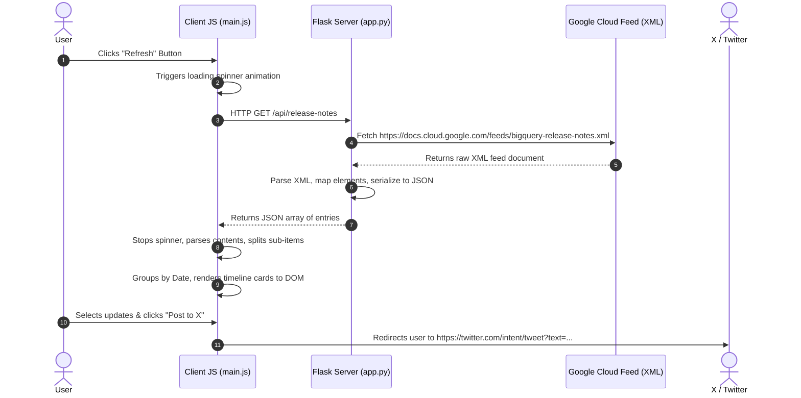

# Architecture Overview: BigQuery Release Notes Hub

This guide breaks down the BigQuery Release Notes Hub project into its core mechanics, separates Server and Client responsibilities, and walks through a complete end-to-end request-response flow.

---

## 1. Key Features Recap

1. **Granular Entry Splitting**: Instead of rendering a whole day's release notes as a single block, the app parses internal tags to isolate individual features, announcements, changes, breaking updates, and issues.
2. **Dashboard Statistics**: Tracks totals for indexed days, processed updates, and the latest release date.
3. **Fuzzy Search & Filters**: Filters cards instantly on typing or clicking specific category tabs.
4. **Draft Composer & Thread Maker**: Pre-composes X (Twitter) updates with tags and links, including support for drafting sequential threads or consolidated highlights.
5. **Theme Engine**: Seamless toggle between responsive dark and light modes.

---

## 2. Server-Side vs. Client-Side Breakdown

```
                    ┌────────────────────────┐
                    │      CLIENT SIDE       │
                    │   HTML / CSS / JS      │
                    └───────────┬────────────┘
                                │
                  1. AJAX GET   │   4. Parses HTML
             /api/release-notes │      via DOMParser
                                ▼
                    ┌────────────────────────┐
                    │      SERVER SIDE       │
                    │      Python Flask      │
                    └───────────┬────────────┘
                                │
                  2. HTTP GET   │   3. Standardizes XML
             Google Feed XML    │      into JSON list
                                ▼
                    ┌────────────────────────┐
                    │   Google Cloud Feed    │
                    │      (XML RSS)         │
                    └────────────────────────┘
```

### A. Server Side (Python / Flask)
The backend is a lightweight proxy and parser. It has two main tasks:
1. **Serve Static UI**: Routes `/` to render the single-page dashboard.
2. **Feed Fetcher & Parser (`/api/release-notes`)**:
   * **Bypassing Headers**: Sets a browser-like `User-Agent` to prevent Google Cloud's servers from blocking the request as a bot.
   * **XML Parse**: Uses Python's built-in `xml.etree.ElementTree` parser.
   * **Namespace Handling**: Maps the default Atom namespace (`xmlns="http://www.w3.org/2005/Atom"`) to cleanly target elements:
     * `<title>` (the release date, e.g., "June 17, 2026")
     * `<updated>` (ISO timestamp)
     * `<link>` (URL targeting the specific section anchor)
     * `<content>` (raw HTML containing the release details)
   * **JSON Serialization**: Transforms the XML objects into a lightweight, standardized JSON payload to transfer to the client.

### B. Client Side (HTML / CSS / JavaScript)
The client handles the presentation, state management, and user interaction.
1. **UI Layer (`index.html`)**: Defines the search inputs, stats counters, timeline layout, and sharing modals.
2. **Style Sheet (`style.css`)**:
   * Declares CSS variables mapped to `--bg-*` and `--text-*` for theme values.
   * Formats the visual hierarchy of lists, code blocks (`code` tag styling), tags, and timeline markers.
3. **Controller (`main.js`)**:
   * **DOMParser Splitting**: The key parser. Since Google bundles multiple updates into a single entry's `<content>` HTML tag separated by `<h3>` tags, the client uses `DOMParser` to parse the HTML string. It groups nodes following each `<h3>` block to separate each feature/bug.
   * **Selection State Tracker**: Manages a JavaScript `Set` storing selected update IDs.
   * **Composer & Threading Logic**: Constructs individual tweets, threads (divided with pagination tags `[1/N]`), or consolidated summaries. It enforces character constraints (280 characters limit) and maps them to standard Twitter Web Intents.

---

## 3. Sample Flow: Request & Response

Let's examine what happens when the user clicks the **"Refresh"** button.



### Detailed Step-by-Step

#### Step 1: Triggering the Request
* When the user clicks the refresh button, the JS adds the `.spinning` CSS class (triggering an infinite rotation animation).
* An asynchronous `fetch('/api/release-notes')` request is dispatched.

#### Step 2: Server Fetching XML
* Flask receives the route. It initiates `urllib.request.urlopen(req, timeout=15)`.
* The server fetches the XML. A sample entry inside the XML looks like this:
  ```xml
  <entry>
    <title>June 16, 2026</title>
    <updated>2026-06-16T00:00:00-07:00</updated>
    <link rel="alternate" href="https://docs.cloud.google.com/bigquery/docs/release-notes#June_16_2026"/>
    <content type="html"><![CDATA[<h3>Announcement</h3><p>Table Explorer is moving...</p>]]></content>
  </entry>
  ```

#### Step 3: Server XML-to-JSON Conversion
* The server uses ElementTree to traverse the feed.
* It parses the entries and returns them to the browser as a JSON list:
  ```json
  [
    {
      "title": "June 16, 2026",
      "updated": "2026-06-16T00:00:00-07:00",
      "link": "https://docs.cloud.google.com/bigquery/docs/release-notes#June_16_2026",
      "content": "<h3>Announcement</h3><p>Table Explorer is moving...</p>"
    }
  ]
  ```

#### Step 4: Client Processing & HTML Parsing
* JS receives the array.
* For each entry, `splitContentToUpdates()` uses `DOMParser` to parse the HTML string.
* Because the HTML starts with `<h3>Announcement</h3>`, it creates a parsed update object:
  ```javascript
  {
    id: "1-0", // Entry Index - Sub Index
    date: "June 16, 2026",
    link: "https://docs.cloud.google.com/bigquery/docs/release-notes#June_16_2026",
    type: "announcement",
    typeDisplay: "Announcement",
    html: "<p>Table Explorer is moving...</p>",
    plainText: "Table Explorer is moving..."
  }
  ```

#### Step 5: Rendering & Interaction
* The updates are sorted by date.
* The script populates the `.feed-timeline` container with grouped date nodes and cards.
* The user highlights a card and clicks **"Tweet Update"**.
* The modal pops up. The editor pre-fills the text using `generateTweetText()`:
  ```
  BigQuery Update [June 16, 2026] - Announcement:
  Table Explorer is moving...

  Read more: https://docs.cloud.google.com/bigquery/docs/release-notes#June_16_2026
  #BigQuery #Announcement
  ```
* The progress ring calculates `(Length / 280) * Circumference` to draw the loading arc.
* When the user clicks **"Post to X (Twitter)"**, the browser runs:
  ```javascript
  window.open(`https://twitter.com/intent/tweet?text=${encodeURIComponent(draftText)}`, '_blank');
  ```
