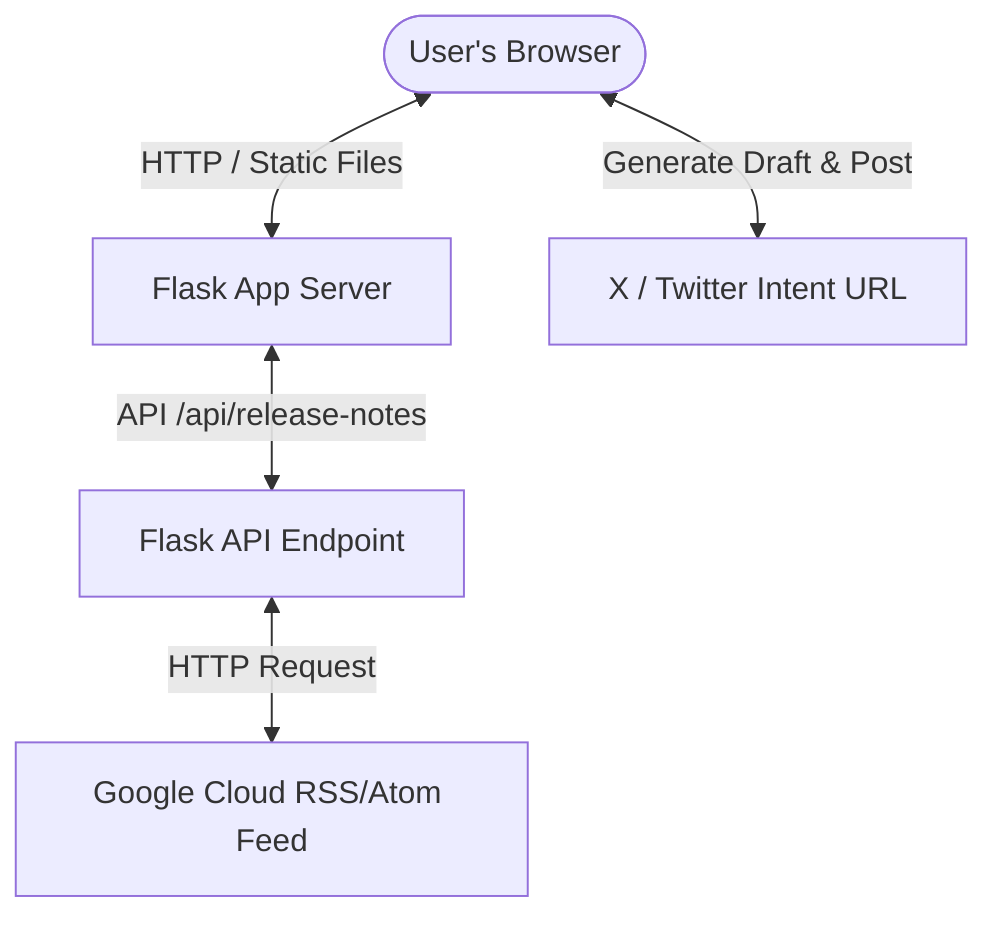

# Implementation Plan: BigQuery Release Notes Hub

This document details the implementation architecture, directory layout, core features, and setup instructions for the **BigQuery Release Notes Hub** web application.

---

## 1. System Architecture & Flow

The application is built using a lightweight **Python Flask** backend and a responsive, interactive **Vanilla HTML/JS/CSS** frontend.



### Data Extraction Flow
1. **Request**: The frontend sends an AJAX `GET` request to `/api/release-notes`.
2. **Fetch**: Flask makes an HTTP request to `https://docs.cloud.google.com/feeds/bigquery-release-notes.xml` with standard user-agent headers to bypass basic crawler blocking.
3. **Parse**: The backend parses the XML stream using `xml.etree.ElementTree` (standard library, zero dependencies) to isolate date entries and their HTML bodies.
4. **Transform**: The frontend parses the HTML contents using the browser's native `DOMParser` to split multi-update days (grouped by `<h3>` tags) into distinct, selectable update blocks.

---

## 2. Directory Structure

All files are placed under `C:\bigquery_viewer` to separate the application code from other workspace files.

```
C:\bigquery_viewer/
├── app.py                      # Flask Application Server
├── templates/
│   └── index.html              # Main HTML Structure
└── static/
    ├── css/
    │   └── style.css           # Custom CSS Design System
    └── js/
        └── main.js             # State Controller & X/Twitter Integration
```

---

## 3. Implementation Details

### Backend: [app.py](file:///C:/Self-learning/5-Day%20AI%20Agents%20-%20Intensive%20Vibe%20Coding%20Course%20With%20Google/agy2-projects/bigquery_viewer/app.py)
* **Technology**: Python 3.12, Flask.
* **Libraries**: `flask`, `urllib.request`, `xml.etree.ElementTree`.
* **Endpoints**:
  * `/`: Renders index dashboard page.
  * `/api/release-notes`: Fetches and maps XML nodes into a structured JSON array.

### Design System: [style.css](file:///C:/Self-learning/5-Day%20AI%20Agents%20-%20Intensive%20Vibe%20Coding%20Course%20With%20Google/agy2-projects/bigquery_viewer/static/css/style.css)
* **Themes**: Supports dark (`data-theme="dark"`) and light (`data-theme="light"`) CSS variables.
* **Typography**: Integrated `Plus Jakarta Sans` for clean, modern readability and `JetBrains Mono` for code blocks.
* **Aesthetics**: Glassmorphism backdrop-filters, custom scrollbars, animated card selections, and color-coded tags for different release types:
  * <span style="color:#34d399">■</span> **Feature**: Green
  * <span style="color:#60a5fa">■</span> **Announcement**: Blue
  * <span style="color:#a78bfa">■</span> **Change**: Purple
  * <span style="color:#f87171">■</span> **Breaking**: Red
  * <span style="color:#fbbf24">■</span> **Issue**: Orange

### Frontend Logic & Sharing: [main.js](file:///C:/Self-learning/5-Day%20AI%20Agents%20-%20Intensive%20Vibe%20Coding%20Course%20With%20Google/agy2-projects/bigquery_viewer/static/js/main.js)
* **Real-time Filter & Search**: Instantly filters dates, titles, and body content text.
* **Multi-selection State**: Leverages a `Set` to track selected release updates.
* **Selection Bar**: A floating footer slides up when items are selected.
* **X Thread Composer**: 
  * Displays circular progress bar matching Twitter's 280-character limit.
  * Generates sequential thread tabs (`[1/N]`, `[2/N]`) or a consolidated summary post.
  * Supports text modifications directly within the app before tweeting.

---

## 4. Setup & Running Instructions

> [!IMPORTANT]
> Ensure you run this application under Python 3.12 or 3.11 where `flask` was installed.

### Step 1: Run the Server
Execute the Flask server using the custom path to the Python environment where `flask` is installed:
```powershell
C:\Users\shaya\AppData\Local\Programs\Python\Python312\python.exe C:\bigquery_viewer\app.py
```

### Step 2: Open browser
Open your browser and navigate to:
**[http://127.0.0.1:5000](http://127.0.0.1:5000)**

---

## 5. Potential Enhancements

> [!TIP]
> Here are features that could be added in future iterations:
> * **Local Database Cache**: Cache release notes in a SQLite database to reduce network calls and enable offline loading.
> * **Automatic Scheduling**: Set up a background worker to fetch notes daily and send push/email alerts.
